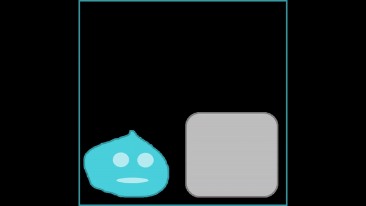

# Sample Markdown Syntax

## Foreword
This is just a sample of some of the Markdown Syntax to write a readme file. You can use them as reference to see how they are used.

## Important Note
Git can only push a certain amount of file size, and Github has a file size limit of 100MB. Please do be mindful while pushing your commits.

You may encounter an error message like the following:
> remote: error: README.md is 132.52 MB; this exceeds GitHub's file size limit of 100 MB

Here is a document from Github with regards to pushing large files:\
[Conditions for large file](https://docs.github.com/en/github/managing-large-files/conditions-for-large-files)

## Headers

Markdown has headers similar to HTML but use hashes 
instead of the letter "h":

`# header 1` :
# header 1
`## header 2` :
## header 2
`### header 3` :
### header 3
`#### header 4` :
#### header 4
`##### header 5` :
##### header 5
`###### header 6` :
###### header 6

<br>

## Font Styles
### Bold
You can bold stuff by using double asterisks(**).\
Or using double underscore(__).\
`**bold text**` or `__bold text__` will turn to **bold text**

### Italics
You can italicise stuff by using single asterisks(*).\
Or using single underscore(_).\
`*italic text*` or `_italic text_` will turn to *italic text*

### Strikethrough
You can strikethrough stuff by using double tilda(~~).\
`~~strikethrough~~` will turn to ~~strikethrough~~

### Combining all three
It is possible to combine all three together: ~~***combined effort***~~

<br>

## Quoting 
By containing things with a single backtick(`) you could quote small 
codes.

For example: \
the start and end of html tags `<h1></h1>`

Or use triple backticks (```) to quote things:


```
This is how you quote large things.
Using triple backticks(`) .
Backtick can be found left of number 1 key.
```
\```<br>
this is how the paragraph was contained<br>
\```

> you could also quote this way

\>this is how you do it, by adding the `>` at the start

Usually the backticks are reserved for codes. But hey, you do you!

<br>

## Links

you can link stuff using the `[ ]( )` brackets together

The `[ ]`portion will hold the title you wish to give to the link.

While the `( )` portion holds the link itself.

An example:\
`[go to youtube](https://www.youtube.com)`

will look like:\
[go to youtube](https://www.youtube.com)

You could also link within your Readme page:\
`[Back to top](https://github.com/muhdarifrawi/23Sept2020-Alda-Html#sample-markdown-syntax)`\
[Back to top](https://github.com/muhdarifrawi/23Sept2020-Alda-Html#sample-markdown-syntax)


## Images and GIFs

You can add an additional exclamation mark(!) to links like so:\
``

Here is an example:

``

Will look like:\


Or you could also use the HTML `` method.

``

Will look like:\


Using HTML `` would allow you to resize your images.

As for GIFs, you can create a small video and convert it into GIFs.\
Generally GIFs are no longer than a minute.

You can add them the follwing way:

``



``


## HTML Syntax

As from the previous examples, you may notice that some HTML syntax 
can be used in Markdown as well.

You can use `<br>` to break lines.

or add `\` to end of sentences to create nice looking paragraphs.

```
this paragraph\
for example
```
Will turn out this way:\
this paragraph\
for example

These are just some of the things you could do.